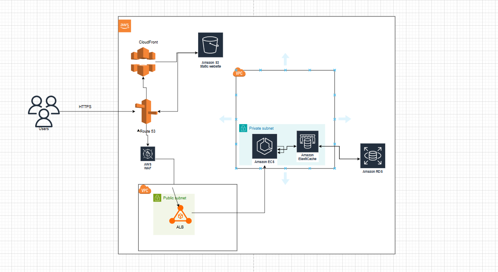

# AWS Architecture and Terraform Deployment

## Overview
This repository contains Terraform code for a three-tier web application on AWS, featuring a static S3 website, a Node.js MySQL CRUD app on ECS, and remote state management with S3 and DynamoDB.

## Architecture Details
- **Presentation**: Route 53 → (CloudFront → S3 for static) or (WAF → ALB → ECS for dynamic).
- **Application**: ECS with ElastiCache caching.
- **Data**: RDS (MySQL).
- **Networking**: VPC with public (ALB) and private (ECS, RDS, ElastiCache) subnets.
- **State**: S3 for remote state, DynamoDB for locking.

### Diagram
```
[Users] --> [Route 53] --> [CloudFront] --> [S3]
                  |                   |
                  +---------> [WAF] --> [ALB] --> [ECS] --> [ElastiCache]
                  |       (Public)     |         (Private)
                  |                    +---------> [RDS]
                  |
                  +-----> [S3 State] <--> [Terraform] <--> [DynamoDB Locks]
```

## Terraform Code
- Defines VPC, subnets, S3 (static/website), CloudFront, Route 53, ALB, WAF, ECS, ElastiCache, RDS, and state management.

## Prerequisites
- AWS account, Terraform, AWS CLI configured.
- Domain in Route 53.

## Setup
1. Clone repo: `git clone <url>`.
2. Update `main.tf` with region, bucket names, domain, image, credentials.
3. Run `terraform init`, `terraform plan`, `terraform apply`.

## Usage
- Modify `main.tf`, re-run `terraform plan/apply`.
- Access: `www.yourdomain.com` (static), `api.yourdomain.com` (API).
- Monitor with CloudWatch.

## Troubleshooting
- Check DynamoDB for locks, ensure IAM permissions.

---

### Notes
- Customize CIDR, names, and security as needed.
